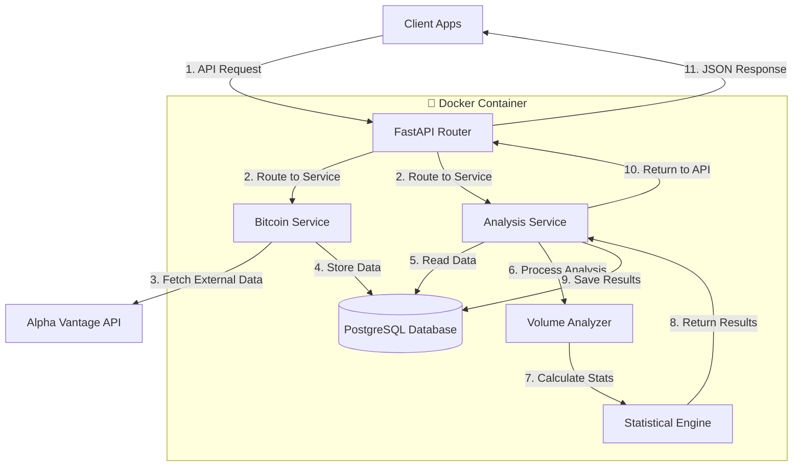

# Quant API - Bitcoin Analysis Platform

FastAPI-based Bitcoin quantitative analysis platform that fetches real-time data and performs advanced statistical analysis.

## What It Does

- 📈 **Fetches Bitcoin Data**: Real-time OHLCV data from Alpha Vantage API
- 📊 **Quantitative Analysis**: Volume-price correlation and trend detection
- 🔌 **REST API**: Clean endpoints for data access and analysis results
- 🐳 **Ready to Deploy**: Docker containerization with PostgreSQL

## Architecture & Workflow



## Quick Start

1. **Setup Environment**
   ```bash
   cp .env.example .env
   # Edit .env with your Alpha Vantage API key and database credentials
   ```

2. **Run with Docker**
   ```bash
   docker-compose up --build
   ```

3. **Access API**
   - 📖 Documentation: http://localhost:8000/docs
   - ❤️ Health Check: http://localhost:8000/health

## API Endpoints

| Endpoint | Description |
|----------|-------------|
| `GET /btc/data` | Fetch latest Bitcoin data |
| `GET /btc/history` | Get historical price data |
| `GET /analysis/volume-price-correlation` | Volume-price analysis |
| `GET /analysis/trends` | Price and volume trends |

## Analysis Features

- **Volume-Price Correlation**: Does volume lead or follow price?
- **Trend Detection**: Identify bullish/bearish patterns
- **Statistical Significance**: Correlation coefficients and tests

## Development

**Local Setup**
```bash
python -m venv venv && source venv/bin/activate
pip install -r requirements.txt
uvicorn api.main:app --reload
```

**Database Migrations**
```bash
alembic upgrade head  # Apply migrations
```

## Required Environment Variables

| Variable | Get From |
|----------|----------|
| `ALPHA_VANTAGE_API_KEY` | [alphavantage.co](https://www.alphavantage.co/support/#api-key) |
| `DATABASE_URL` | Your PostgreSQL connection string |

## Tech Stack

- **FastAPI** - Modern Python web framework
- **SQLAlchemy** - Database ORM
- **PostgreSQL** - Database
- **Docker** - Containerization
- **NumPy** - Numerical computing for analysis

---

**License**: MIT | **Issues**: [GitHub Issues](../../issues)
